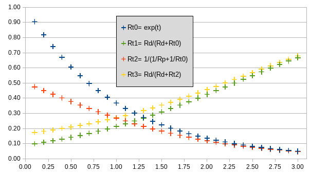

# Duino
Embedded stuff - builds under Arduino IDE

---
## Miscellaneous Project Design Materials

A dumping ground, perhaps temporary...  

### Thermistor NTC signal conditioning

* The charactersitic function of a thermistor is exponential:
Rt &#8733; exp(t)  

* A thermistor in a voltage divider circuit exhibits a linearised response.  

	* This allows a simple model to provide reasonable accuracy over a limited range.
	* For the NTC thermistor, linearity appears better at higher temperatures.
	* A high side divider inverts the gradient of the NTC response (whereas a low side divider
maintains the negative temperature coefficient).  
  
* A resistor in parallel with a thermistor also has a linearising effect.  

	* Other than adjusting voltage range versus resolution, this offers no advantage over the simple voltage divider.

